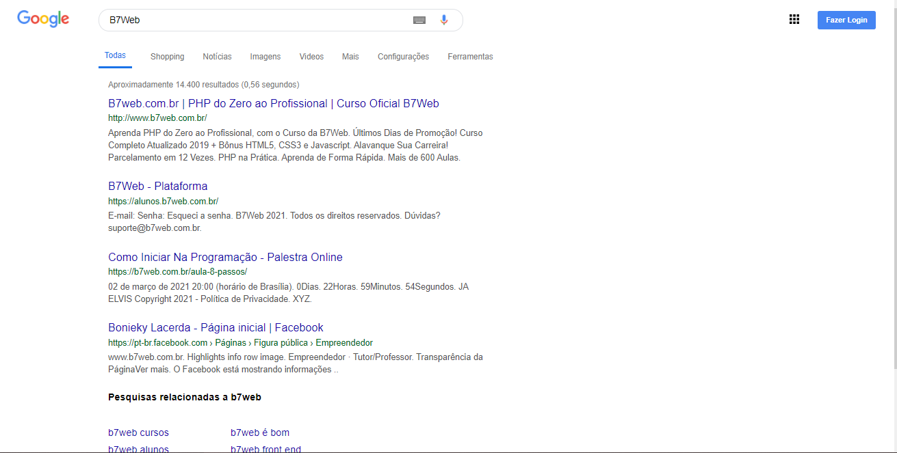

<h1 align="center">SearchGoogle</h1>

<p align="center">
  

  

  

  
  
  
  <br>
  
  <a href="https://www.codacy.com/manual/Gabriel4420/searchgoogle?utm_source=github.com&amp;utm_medium=referral&amp;utm_content=Gabriel4420/searchgoogle&amp;utm_campaign=Badge_Grade">
    
  </a>
  
  

</p>

<p align="center">
  
</p>

<p align="center">
  <a href="#dart-about">Sobre</a> &#xa0; | &#xa0; 
  <a href="#rocket-technologies">Linguagens</a> &#xa0; | &#xa0;
  <a href="#checkered_flag-starting">Starting</a> &#xa0; | &#xa0;
  <a href="https://github.com/gabriel4420" target="_blank">Author</a>
</p>

<br>

## :dart: Sobre ##

Projeto feito no curso da B7web para fixação de HTML5 e CSS3, ministrado por Bonieky Lacerda.


## :rocket: Linguagens ##

O projeto foi feito utilizando HTML5 e CSS3

## :checkered_flag: Starting ##

```bash
# Clone this project
$ git clone https://github.com/Gabriel4420/searchgoogle

# Access
$ cd searchgoogle
```


<h4 align="center">
  Feito com ❤️ por Gabriel Rodrigues 👋️ <a href="mailto:gabriel_rodrigues_perez@hotmail.com">Entre em contato!</a>
</h4>

<p align="center">

  <a href="https://www.linkedin.com/in/gabriel-rodrigues-perez-2069b072/">
    
  </a>
  <a href="https://www.facebook.com/gabriel.rodrigues.perez">
    
  </a>
  <a href="https://www.instagram.com/gabriel_rodrigues_perez/">
    
  </a>
  
  
</p>

&#xa0;

<a href="#top">Back to top</a>
